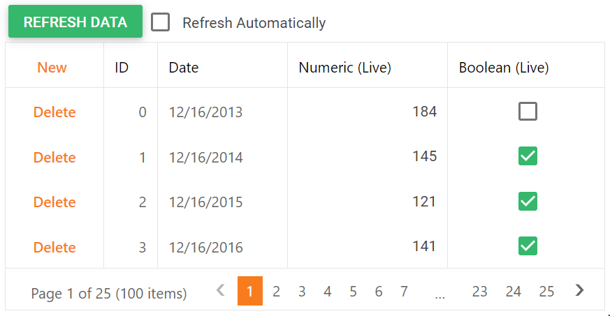

<!-- default badges list -->

[](https://supportcenter.devexpress.com/ticket/details/T530119)
[](https://docs.devexpress.com/GeneralInformation/403183)
[](#does-this-example-address-your-development-requirementsobjectives)
<!-- default badges end -->
# Grid View for ASP.NET Web Forms - How to use the WebMethod attribute to update data in particular grid columns

This example demonstrates how to create data item templates and use the **WebMethod** attribute to update data in templated columns without refreshing the entire grid.



## Overview

Follow the steps below:

1. Specify a column's [DataItemTemplate](https://docs.devexpress.com/AspNet/DevExpress.Web.GridViewDataColumn.DataItemTemplate) property and add a control to the template. In the control's `Init` event handler, specify the control's `ClientInstanceName` property based on the row's key value.

    ```aspx
    <dx:GridViewDataSpinEditColumn FieldName="C2" Caption="Numeric (Live)">
        <DataItemTemplate>
            <dx:ASPxLabel ID="labelC1" runat="server" Text='<%# Eval("C2") %>' OnInit="labelC1_Init" />
        </DataItemTemplate>
    </dx:GridViewDataSpinEditColumn>
    <dx:GridViewDataCheckColumn FieldName="C4" Caption="Boolean (Live)">
        <DataItemTemplate>
            <dx:ASPxCheckBox ID="cbC4" runat="server" Value='<%# Convert.ToBoolean(Eval("C4")) %>'
                ReadOnly="true" OnInit="cbC4_Init" />
        </DataItemTemplate>
    </dx:GridViewDataCheckColumn>
    ```

    ```csharp
    protected void labelC1_Init(object sender, EventArgs e) {
        ASPxLabel label = sender as ASPxLabel;
        GridViewDataItemTemplateContainer container = label.NamingContainer as GridViewDataItemTemplateContainer;
        label.ClientInstanceName = "labelC1_" + container.KeyValue;
    }
    protected void cbC4_Init(object sender, EventArgs e) {
        ASPxCheckBox cb = sender as ASPxCheckBox;
        GridViewDataItemTemplateContainer container = cb.NamingContainer as GridViewDataItemTemplateContainer;
        cb.ClientInstanceName = "cbC4_" + container.KeyValue;
    }
    ```

2. Send a request to the server to get new values and use the [WebMethod](https://learn.microsoft.com/en-us/previous-versions/visualstudio/visual-studio-2008/byxd99hx(v=vs.90)?redirectedfrom=MSDN) attribute to pass the values to the client.

    ```js
    PageMethods.GetUpdatedDataFromServer(keys, onSucess, onError);
    ```

    ```csharp
    [WebMethod]
    public static string GetUpdatedDataFromServer(int[] keys) {
        ChangeAllColumnDataRandomly();
        List<GridDataItem> GridData = GetDataSource();
        List<GridDataItem> newDataRequiredForClient = new List<GridDataItem>();

        foreach (int keyValue in keys) {
            GridDataItem item = GridData.Find(x => x.ID == keyValue);
            newDataRequiredForClient.Add(item);
        }
        var jsonSerialiser = new JavaScriptSerializer();
        var json = jsonSerialiser.Serialize(newDataRequiredForClient);
        return json;
    }
    public static void ChangeAllColumnDataRandomly() {
        // ...
    }
    public static List<GridDataItem> GetDataSource() {
        // ...
    }
    ```

3. Update data in templated columns on the client side or specify an error message.

    ```js
    function onSucess(result) {
        var items = JSON.parse(result);
        for (var i = 0; i < items.length; i++) {
            var label = ASPxClientControl.GetControlCollection().GetByName("labelC1_" + items[i].ID);
            label.SetText(items[i].C2);
            var checkBox = ASPxClientControl.GetControlCollection().GetByName("cbC4_" + items[i].ID);
            checkBox.SetChecked(items[i].C4);
        }
    }
    function onError(result) {
        alert('Something wrong!');
    }
    ```


## Files to Review

* [Default.aspx](./CS/Default.aspx) (VB: [Default.aspx](./VB/Default.aspx))
* [Default.aspx.cs](./CS/Default.aspx.cs) (VB: [Default.aspx.vb](./VB/Default.aspx.vb))

## Documentation

* [Grid View Temlplates](https://docs.devexpress.com/AspNet/3718/components/grid-view/concepts/templates)
* [Access Controls in Templates on the Server](https://docs.devexpress.com/AspNet/403575/common-concepts/access-controls-in-templates-on-the-server)

## More Examples

* [How to display dynamic data within the ASPxGridView (Live Data) without full grid updating using the ASPxCallback control](https://github.com/DevExpress-Examples/how-to-display-dynamic-data-within-the-aspxgridview-live-data-without-full-grid-updating-usi-e4326)
<!-- feedback -->
## Does this example address your development requirements/objectives?

[](https://www.devexpress.com/support/examples/survey.xml?utm_source=github&utm_campaign=asp-net-web-forms-grid-use-webmethods-to-update-data&~~~was_helpful=yes) [](https://www.devexpress.com/support/examples/survey.xml?utm_source=github&utm_campaign=asp-net-web-forms-grid-use-webmethods-to-update-data&~~~was_helpful=no)

(you will be redirected to DevExpress.com to submit your response)
<!-- feedback end -->
